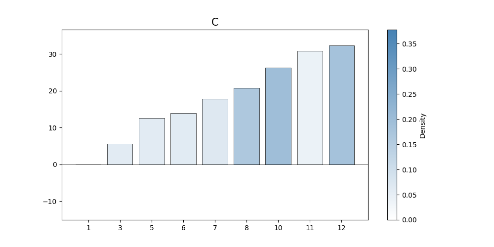
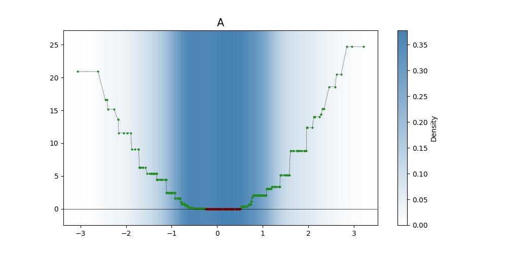
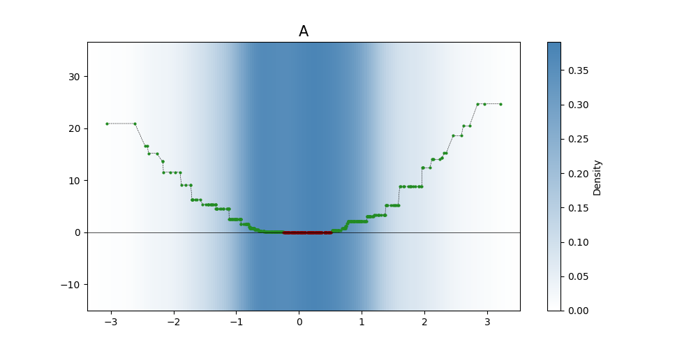
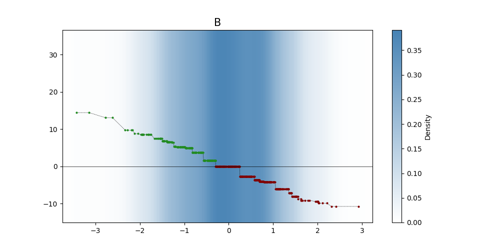
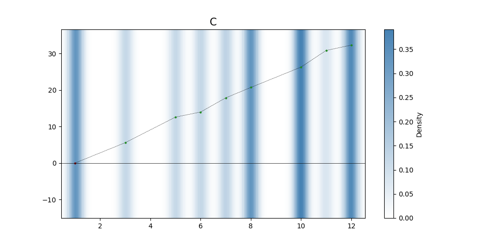
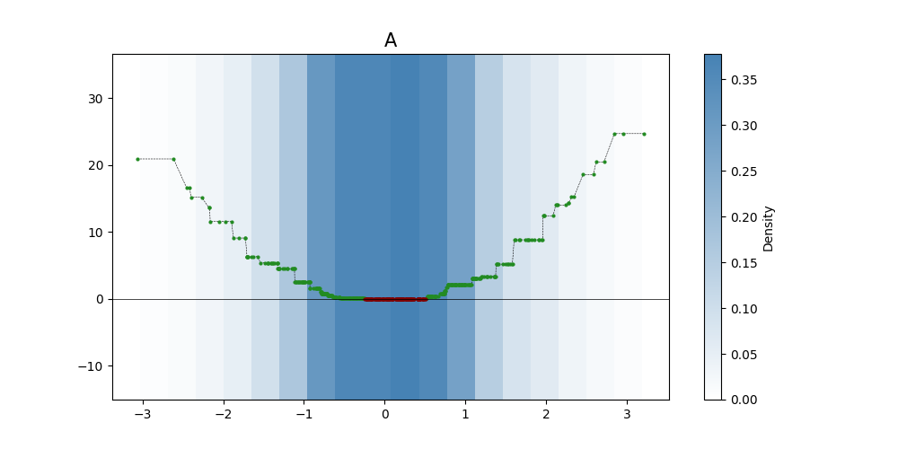
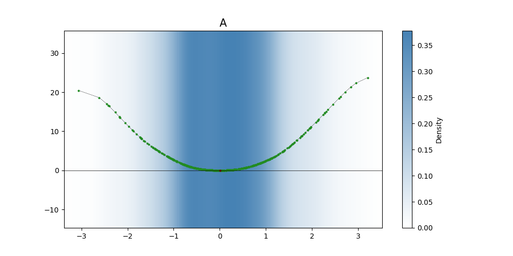
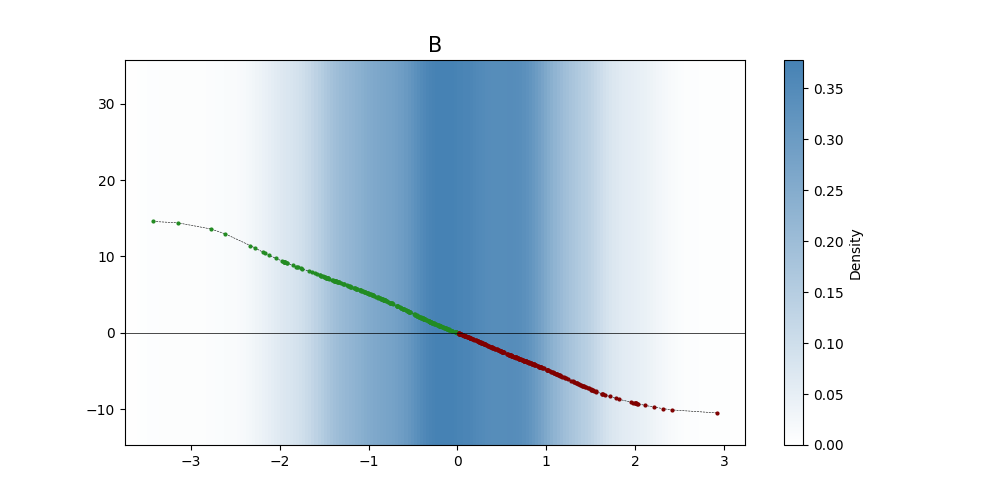
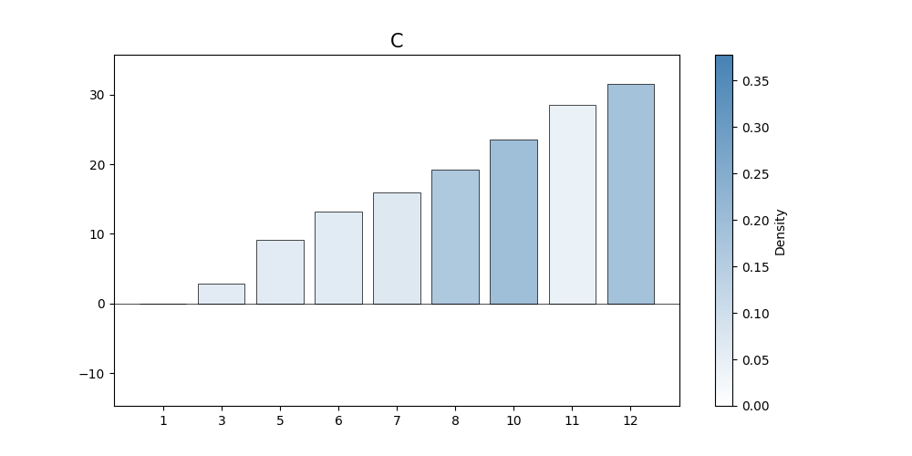

### Generate Demo Training Data
>```python
>df1 = pd.DataFrame(np.random.randn(500, 2), columns=list('AB'))
>
>probabilities = [0.16, 0, 0.04, 0, 0.07, 0.06, 0.08, 0.17, 0, 0.18, 0.05, 0.19]
>
>df2 = pd.DataFrame(np.random.choice(np.arange(1, 13), size=(500,2), p=probabilities), columns=list('CD'))
>
>df = pd.concat([df1, df2], axis=1)
>
>y = 3 * df['A']**2 - 5 * df['B'] + 3 * df['C']
>```

> [!NOTE]
> Since the demo data is random, different runs will produce slightly different results.

### Create `xgbGAMView` Instance
> Set the XGBoost `objective` parameter to `reg:squarederror` for regression task.
>```python
>example = xgbGAMView(param={'objective':'reg:squarederror'})
>```

### `fit(X, y, train_param={})`
> Train the model.
> ```python
>train_param = {'num_boost_round':100}
>
>example.fit(df,y,train_param)
>```

### `Predict(X)`
> Generate prediction for given x.
>```python
>x = pd.DataFrame([[1, 1, 10, 10]], columns=list('ABCD'))
>
>example.predict(x)
>```
>
>**output:**
>```
>array([28.297756], dtype=float32)
>```

### `feature_contribution(X)`:
> Find the contribution of each feature in x to its prediction.
>
>```python
>example.feature_contribution(x)
>```
>
>**output:**
>```
>	 	            A	 	     B		    C	 	  D
>Value	        1.000000	 1.000000	 10.0000	10.0
>Contribution	2.081997	 -4.218919	 26.2906	 0.0
>```

### `plot(*, name='xgbGAMView', bandwidth=0.2, features=[], ctg_or_cnt={}, n_density_samples=200)`:
> Generate shape function figures for all features.  
> The plots will be saved in a directory named 'Example_Plots'.  
>```python
>example.plot(name = 'Example_Plots')
>```
>
>**output:**
>
>
>
>
> 

> Generate shape function figure only for the 'A' feature.  
> The plots will be saved in a directory named 'Example_Plots_I'.  
>```python
>example.plot(name = 'Example_Plots_I' , features = ['A'])
>```
>
>**output:**
>

> Specify the 'C' feature as 'Continuous', resulting in a scatter plot presentation instead of a bar graph.  
> The plots will be saved in a directory named 'Example_Plots_II'.  
>```python
>example.plot(name = 'Example_Plots_II' , ctg_or_cnt={'C':'Continuous'})
>```
>
>**output:**
>
>
>
>
>

> Set the number of samples used for Kernel Density Estimation (KDE) to represent the density distribution when plotting continuous features.  
> The plots will be saved in a directory named 'Example_Plots_III'.  
>```python
>example.plot(name = 'Example_Plots_III' , n_density_samples = 20)
>```
>
>**output:**
>
>
>
>
>

> Set the beta parameter used for smooth shape function predictions.  
> When an int is provided, the value applies to all features.  
> The shape functions become smoother.  
> The plots will be saved in a directory named 'Example_Plots_IV'.  
>```python
>example.set_beta(5)
>example.plot(name = 'Example_Plots_IV')
>```
>
>**output:**
>
>
>
>
>


> Set the beta parameter used for smooth shape function predictions.  
> When dictionary is provided, different beta values are applied to different features.  
> As a result, the shape functions for 'A' and 'B' will exhibit different levels of smoothing.  
> Feature 'C' is not included in the dictionary, so its beta will be `None`.  
> The plots will be saved in a directory named 'Example_Plots_V'. 
>```python
>example.set_beta({'A':100,'B':5})
>example.plot(name = 'Example_Plots_V')
>```
>
>**output:**
>
>
>
>
>
